# Vue3 + TS开发环境创建
## 1. 创建环境
vite除了支持基础阶段的纯TS环境之外，还支持 Vue + TS开发环境的快速创建, 命令如下：
```bash
$ npm create vite@latest  vue-ts-pro -- --template vue-ts 
```

说明：

1. npm create vite[@latest ](/latest )   基于最新版本的vite进行项目创建 
2. vue-ts-pro    项目名称
3. -- --template vue-ts    选择Vue + TS的开发模板

## 2. 和.vue文件相关的工具 
**开发阶段**

1. **Volar**工具对.vue文件进行实时的类型错误反馈
2. **TypeScript Vue Plugin** 工具用于支持在 TS 中 import *.vue 文件

**打包阶段**
  vue-tsc工具负责打包时最终的类型检查

好处：开发阶段的类型提示交给IDE做，保证vite的运行速度，打包阶段做’兜底类型校验’，确保类型无误


# 为Ref标注类型

## 1. 场景和好处
为ref标注类型之后，既可以在**给ref对象的value赋值时校验数据类型**，同时**在使用value的时候可以获得代码提示**
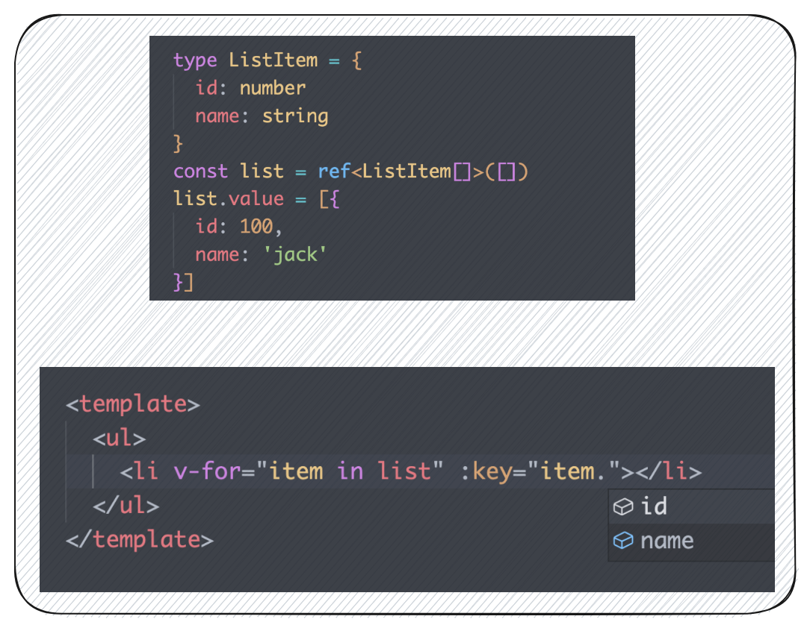
说明：本质上是给ref对象的value属性添加类型约束

## 2. 如何标注
ref 函数和 TS 的配合通常分为俩种情况，类型推导和泛型指定类型
1. 如果是简单的数据，推荐使用**类型推导**

2. 如果是较复杂的数据，从后台获取，通过**泛型指定类型**
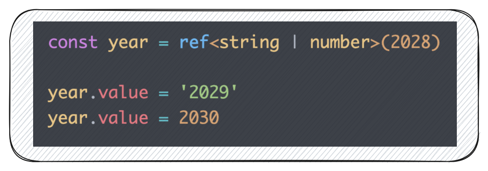

## 3. 思考题
标注ref函数类型，可以满足把下图所示的数据赋值给value属性
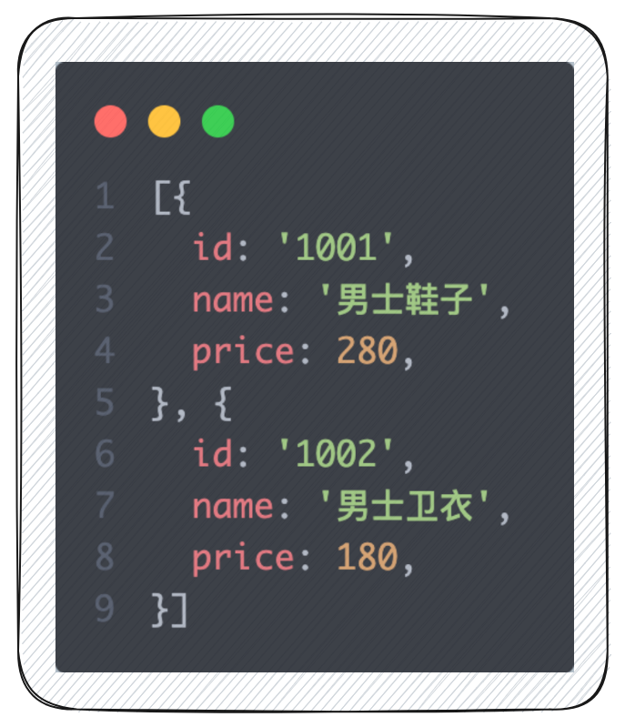

```js
type Item = {
    id: string
    name: string
    price: number
}
const list = ref<Item[]>([])

list.value = [
    {
        id: '101',
        name: '男士鞋子',
        price: 200
    }
]
<li v-for="item in list" :key="item.id">{{ item.name }}</li>
```


# 为reactive标注类型

**场景和好处**

为reactive标注类型之后，既可以在响应式对象在**修改属性值的时候约束类型**，也可以在**使用时获得代码提示**

```js
const form = reactive({
    username: '',
    password: ''
})
form.username = '100'
// form.username = 100 x

<template>
    {{ form. }}   // 使用时获得代码提示
</template>
```

**如何标注类型**

reactive 函数和 TS 的配合通常分为两种情况，**类型推导和显示标注**

1. 如果根据**默认参数对象推导的类型符合要求**，推荐使用类型推导

   ```js
   const form = reactive({
       username: '',
       password: ''
   })
   ```

2. 如果根据默认对象**推导不出我们想要的类型**，推荐使用**类型别名**给变量显示注解对应类型

   ```js
   type Form = {
       username: string
       password: string
       isAgree?: boolean
   }
   const form: Form = reactive({
       username: '',  
       password: ''     // 这里必须和上面一致
   })
   // 使用时赋值 
   // form.password = '123'
   
   type User = {
     username: string
     address: string
     phone: string
     gender?: string
   }
   const user:User = reactive({
     // 必须满足User类型
   })
   ```

   说明：显示注解变量之后除了对**属性赋值的时候做了类型约束**而且要求**reactive的初始值**也需要满足类型要求


# 为computed标注类型

**如何进行类型标注**

计算属性通常由已知的响应式数据计算得到，所以**依赖的数据类型一旦确定**通过**自动推导**就可以知道计算属性的类型另外根据最佳实践，计算属性多数情况下是只读的，不做修改，所以配合TS一般**只做代码提示**

```js
const count = ref(100)

        // const doubleCount: ComputedRef<number>
const doubleCount = computed(()=> count.value * 2)

// doubleCount.value.  // bumber类型方法
```

需求：给ref函数标注类型，接收后端返回对象列表，然后使用计算属性做过滤计算，计算得到单价大于500商品

```js
[
    { id: '1001', name:'男鞋' , price: 888 },
    { id: '1002', name:'女鞋' , price: 468 }
]

// 1. ref标注类型
type Item = {
    id: string
    name: string
    price: number
}
const list = ref<Item[]>([])

const filterList = computed(() => list.value.filter(item => item.price >= 500))
```


# 为事件处理函数标注类型
## 1. 为什么需要标注类型
原生dom事件处理函数的参数默认会自动**标注为any类型**，没有任何类型提示，为了获得良好的类型提示，需要手动标注类型
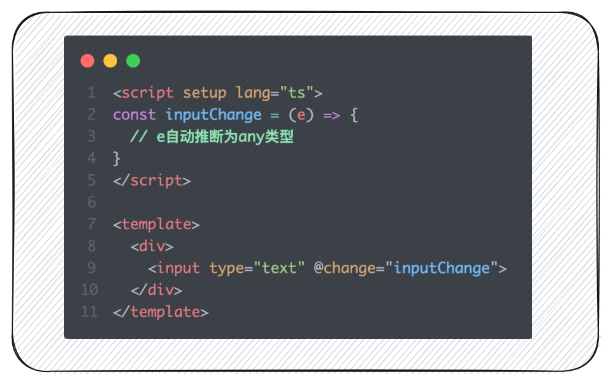

## 2. 如何标注类型
1. 给事件对象形参 e 标注为**Event类型**，可以获得事件对象的相关类型提示
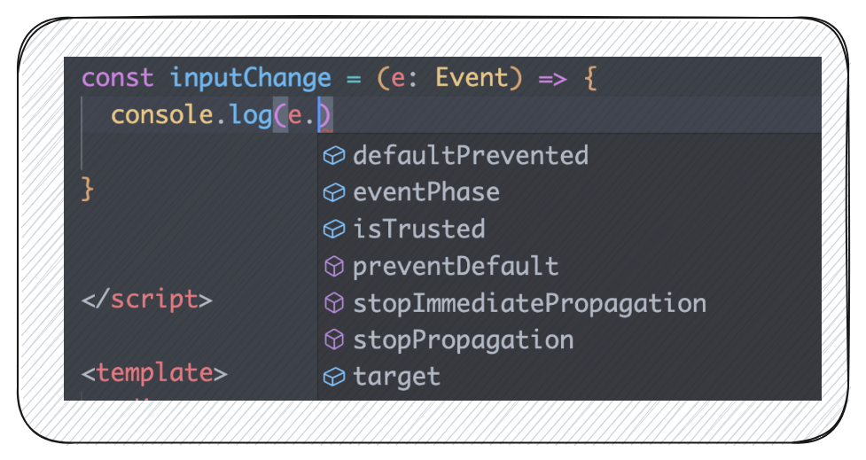
2. 如果需要更加精确的DOM类型提示可以使用**断言（as）**进行操作
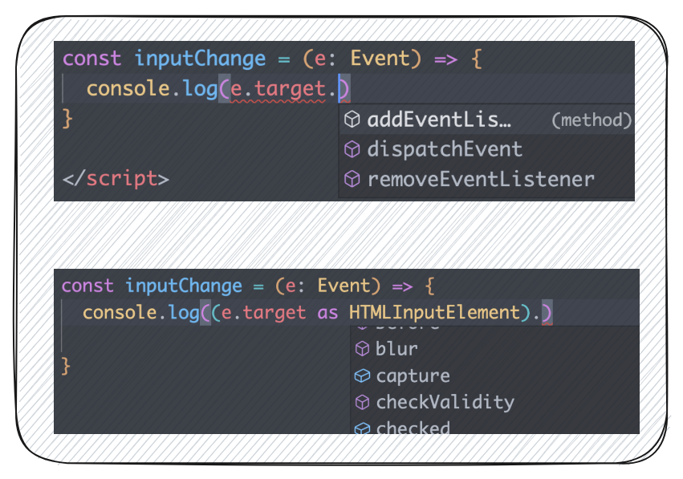
# 为模版引用标注类型
## 1. 为什么需要类型标注
给模版引用标注类型，本质上是**给ref对象的value属性添加了类型约束**，约定value属性中存放的是**特定类型的DOM对象**，从而在使用的时候获得相应的代码提示

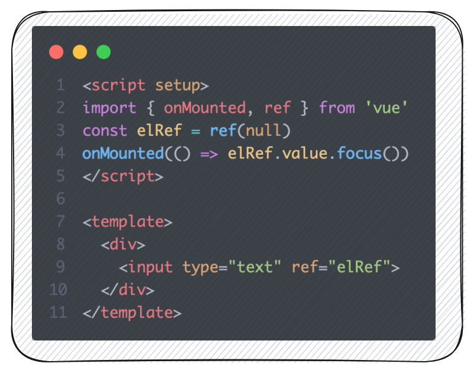
## 2. 如何进行类型标注
通过具体的DOM类型联合null做为泛型参数, 比如我们想获取一个input dom元素

`inputRef.value 存放的数据在组件渲染完毕之前是 null    渲染完毕之后才是真实的dom   可选链`

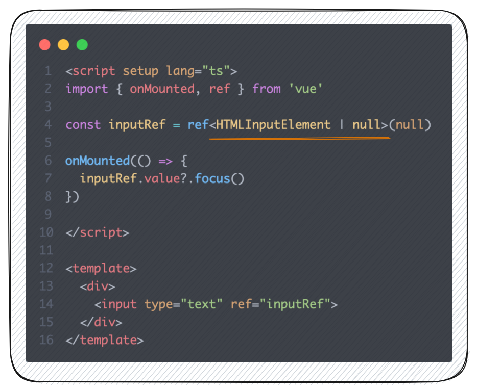

尝试为模版引用标注类型获取一个a元素？`  const  aRef = ref<HTMLAnchorElement | null>(null)`


# 对象的非空值处理
## 1. 空值场景说明
当**对象的属性可能是 null 或 undefined 的时候**，称之为“空值”，尝试访问空值身上的属性或者方法会发生类型错误
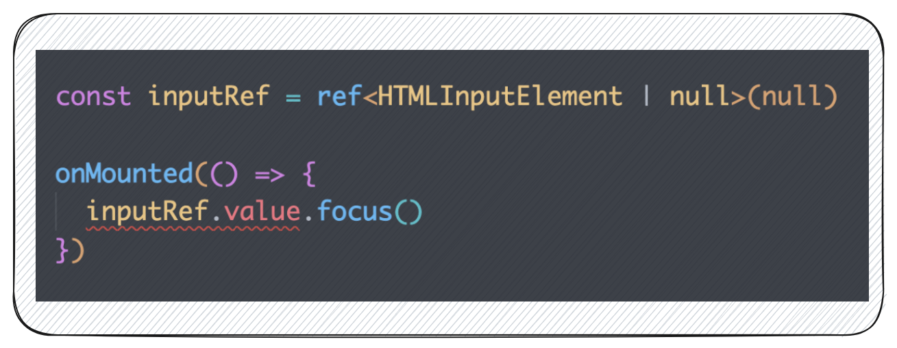
说明：inputRef变量在组件挂载完毕之前，value属性中存放的值为null，不是input dom对象，通不过类型校验

## 2. 可选链方案
可选链 ?. 是一种访问嵌套对象属性的安全的方式, 可选链前面的值为 undefined 或者 null时，它会停止运算
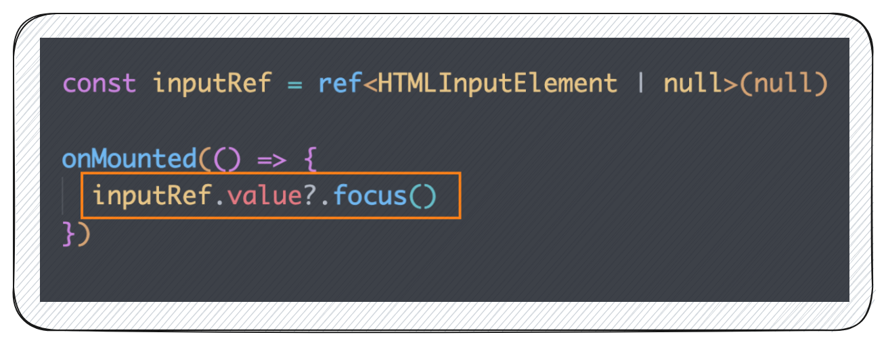

## 3. 逻辑判断方案
通过逻辑判断，只有有值的时候才继续执行后面的属性访问语句
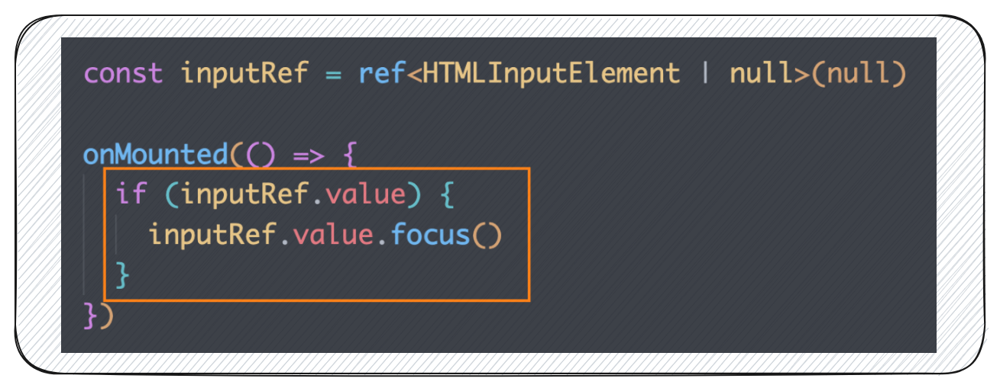

## 4. 非空断言方案
**非空断言（!）是指我们开发者明确知道当前的值一定不是null或者undefined，让TS通过类型校验**
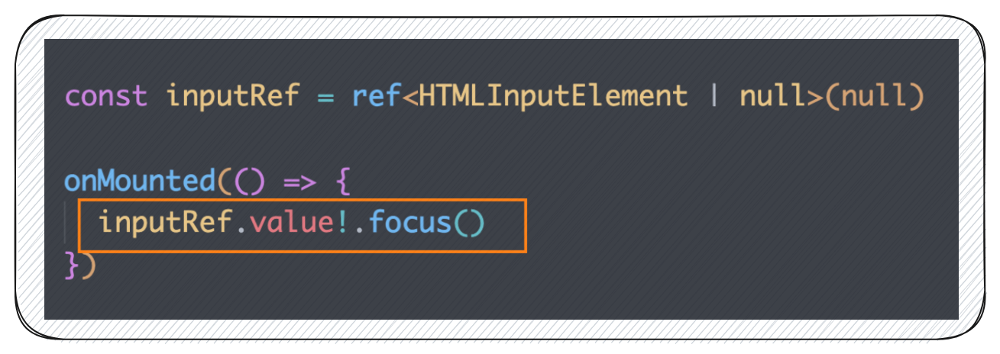
**特别注意：**使用非空断言要格外小心，它没有实际的JS判断逻辑，只是通过了TS的类型校验，容易直接把空值出现在实际的执行环境里


# 为组件的Props标注类型

## 1. 为什么给Props标注类型
给组件的Props标注类型有俩个作用，一个是确保传递的prop是类型安全的，另一个在组件内部使用的时候也会有类型提示


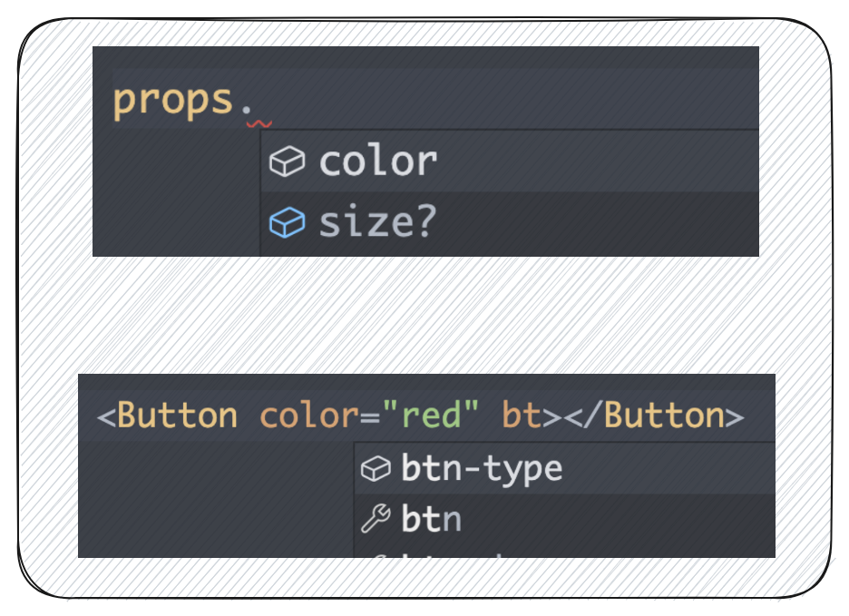

## 2. 基础使用
语法：通过**defineProps宏函数**对组件props进行类型标注
需求：按钮组件有俩个prop参数，color类型为string且为必填，size类型为string且为可选，怎么定义类型？
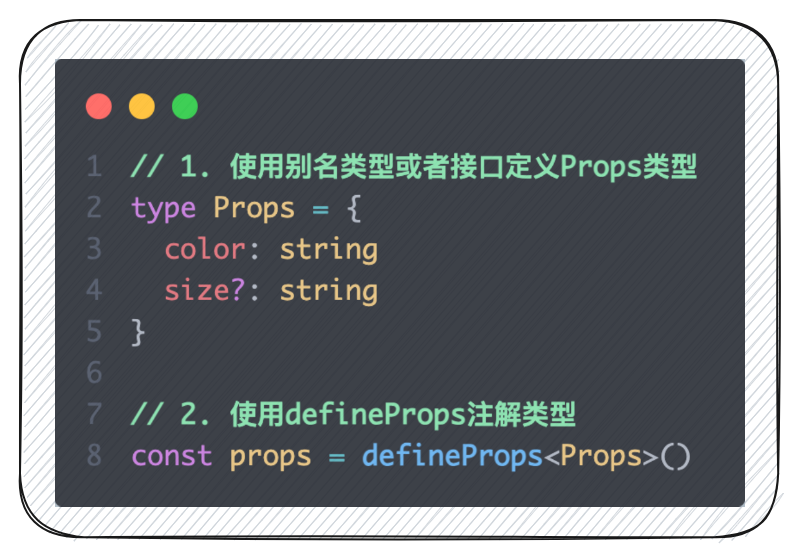
说明：按钮组件传递prop属性的时候必须满足color是必传项且类型为string, size为可选属性，类型为string


## 3. Props默认值设置

场景：Props中的可选参数通常除了指定类型之外还需要提供默认值，可以使用**withDefaults宏函数**来进行设置
需求：按钮组件的size属性的默认值设置为 middle
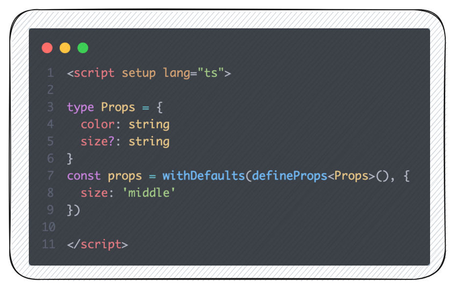
说明：如果用户传递了size属性，按照传递的数据来，如果没有传递，则size值为 ’middle’

给按钮组件添加一个btnType属性，类型为 ’success‘, ‘danger’ 或者 ’warning‘ 三选一, 默认值为 ’success‘

```js
<script setup lang="ts">
   // 定义 props 类型

   // 1. 通过类型别名（接口）定义 Props 类型
   type BtnType = 'success' | 'danger' | 'warning'

    type Props = {
      color: string
      size?: string
      BtnType?: BtnType
    }

   // 2. defineProps<Props>
 withDefaults( defineProps<Props>(), {
  size: 'middle',
  BtnType: 'success'
 })

</script>
```


# 为组件的emits标注类型
## 1. 为什么需要标注类型
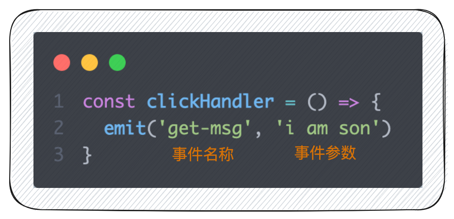
作用：可以**约束事件名称**并给出自动提示，确保不会拼写错误，同时约束传参类型，不会发生参数类型错误

## 2. 何为组件的emits标注类型
语法：通过 defineEmits 宏函数进行类型标注
需求：子组件触发一个名称为 ’get-msg‘ 的事件，并且传递一个类型为string的参数
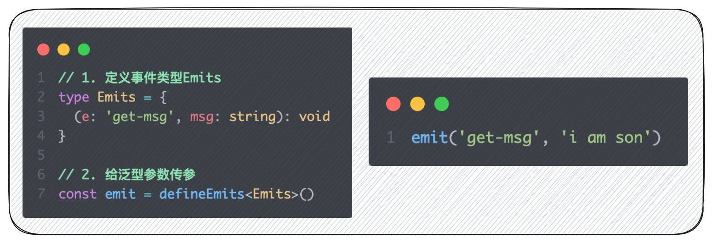

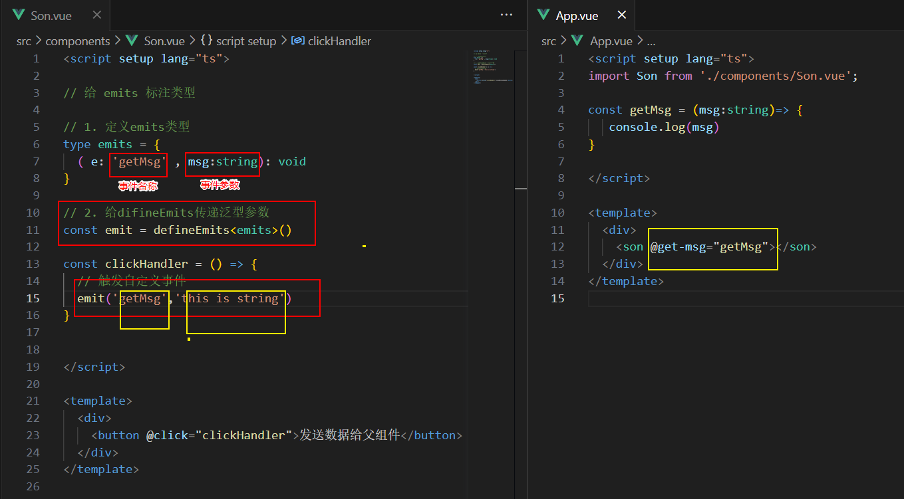

## 3. 思考题

Son组件再触发一个事件’get-list’, 传递参数类型为下图所示的数据类型
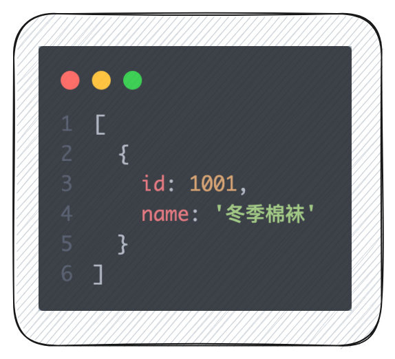

```js
<script setup lang="ts">

// 给 emits 标注类型
type listItem = {
    id: number
    name: string
}
    
// 1. 定义emits类型
type emits = {
  ( e: 'getMsg' , msg:string): void
  ( e: 'get-list' , list: listItem[]): void
}

// 2. 给difineEmits传递泛型参数
const emit = defineEmits<emits>()

const clickHandler = () => {
  // 触发自定义事件
  emit('getMsg','this is string')
  emit('get-list', 1001 , '冬季棉袜')
}
```


# 类型声明文件

## 1. 什么是类型声明文件
概念：在TS中以**d.ts为后缀的文件**就是类型声明文件，主要作用**是为js模块提供类型信息支持**，从而获得类型提示


说明：

1. d.ts是如何生效的？
在使用js某些模块的时候，TS会自动导入模块对应的d.ts文件，以提供类型提示
2. d.ts是怎么来的？
库如果本身是使用TS编写的，在打包的时候经过配置自动生成对应的d.ts文件（axios本身就是TS编写的）

## 2. 使用 DefinitelyTyped 提供类型声明文件
场景：**有些库本身并不是采用TS编写的，无法直接生成配套的d.ts文件**，但是也想获得类型提示，此时**需要 Definitely Typed 提供类型声明文件**
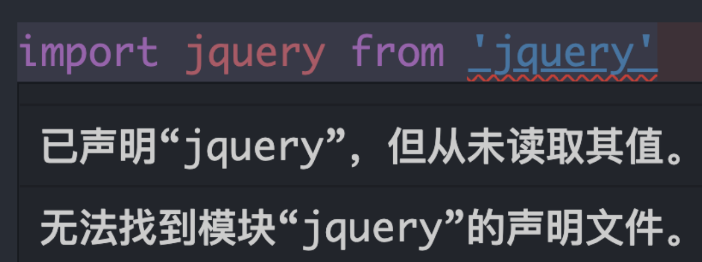

**DefinitelyTyped是一个TS类型定义的仓库，专门为JS编写的库可以提供类型声明，比如可以安装 @types/jquery 为jquery提供类型提示**

```js
npm install @types/js编写的三方库包名 -D
```


## 3. TS内置类型声明文件
**TS为JS运行时可用的所有标准化内置API都提供了声明文件，这些文件既不需要编译生成，也不需要三方提供**

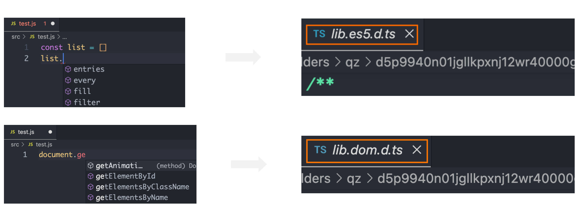

说明：这里的lib.es5.d.ts以及lib.dom.d.ts都是内置的类型声明文件，为原生js和浏览器API提供类型提示
## 4. 自定义类型声明文件
d.ts文件在项目中是可以进行自定义创建的，通常有俩种作用，第一个是**共享TS类型**（重要），第二种是给js文件提供类型（了解）

**场景一：共享TS类型**


说明：哪个业务组件需要用到类型导入即可，**为了区分普通模块，可以加上type关键词**

**场景二：给JS文件提供类型**
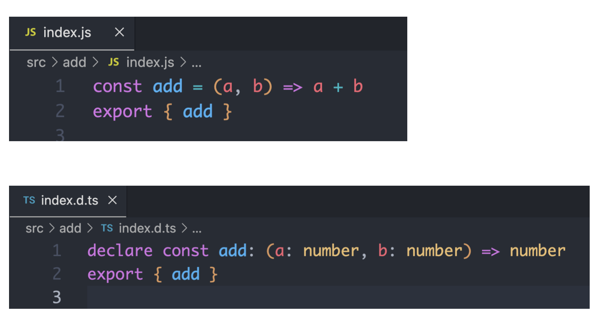

说明：**通过declare关键词可以为js文件中的变量声明对应类型，这样js导出的模块在使用的时候也会获得类型提示**

## 5. .ts文件和d.ts文件对比
TS中有俩种文件类型，一种是.ts文件，一种是.d.ts文件
.ts文件

1. 既可以包含类型信息也可以写逻辑代码
2. 可以被编译为js文件

.d.ts文件

1. 只能包含类型信息不可以写逻辑代码
2. 不会被编译为js文件，仅做类型校验检查

